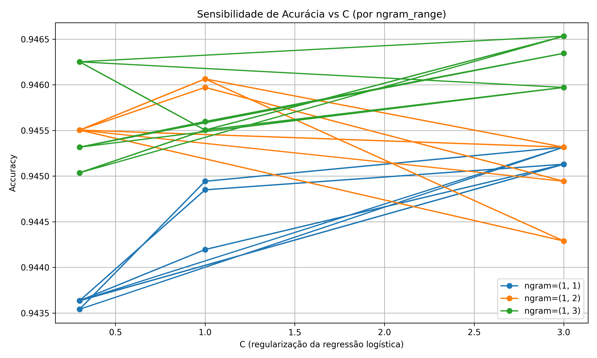

# Global Economic Calendar Feeds  
### by [João Casella](https://github.com/joaoalonsocasella)

This repository hosts a continuously updated collection of **global economic calendars** — one for each country — provided in the standard **ICS (iCalendar)** format.  

All calendars are automatically updated through **GitHub Actions** and can be easily downloaded and added to **Outlook**, **Google Calendar**, **Apple Calendar**, or any other calendar app supporting iCalendar feeds.

---

## 🌐 Download Calendar Page

**Access all country calendars here:**  
🔗 [https://joaoalonsocasella.github.io/Economic_Calendar/](https://joaoalonsocasella.github.io/Economic_Calendar/)

After downloading the `.ics`, you may choose:

- **Static Import** → drag and drop into your calendar  
- **Dynamic Subscription (recommended)** → copy the feed URL and paste it in your calendar’s subscription area (auto-updates)

---

## About the Project

**EconomicCalendar** is an open-source project designed to aggregate, classify, and distribute global **macroeconomic event data** in a clean and machine-readable format.

All data is sourced from:  
[**MarketPulse – Economic Calendar**](https://www.marketpulse.com/tools/economic-calendar/)

---

## ⚙️ Architecture Overview

The project is divided into five main modules that form a complete automated pipeline:

### Calendar Web-scrapping automation (`/scripts/scrap/`)

| Script | Description |
|---------|-------------|
| `Update.py` | Runs all country scrapers in parallel to collect `.csv` and `.ics` data from MarketPulse. |
| `Combine.py` | Merges all `.ics` files into a single unified global calendar. |
| `GenerateLinks.py` | Updates the HTML index with calendar URLs for GitHub Pages. |

**Output:**  
Fresh calendar data saved in `data/raw/` (CSV + ICS, per country).

---

### API Layer (`/scripts/api/`)

| Script | Description |
|---------|-------------|
| `main.py` | FastAPI backend serving endpoints with calendar, category, and impact data. |
| `utils.py` | Helper utilities for JSON normalization, caching, and request parsing. |

#### Web adress
`https://economic-calendar-api-h9hr.onrender.com`

#### Run Locally
To start the API in your own machine:
`uvicorn api.main:app --reload`


Base Adress (generic output from FastAPI):
`http://127.0.0.1:8000`

#### API Filters:

- Country's entire economic calendar info:
  - add `/events?country={iso3}`
  - Example: `http://127.0.0.1:8000/events?country=BRA`
- Country's calendar events filtered by **Impact** (LOW | MEDIUM | HIGH):
  - add `&impact={impact_level}` to the country query
  - Example: `http://127.0.0.1:8000/events?country=BRA&impact=HIGH`
- Country's calendar events filtered by **macroeconomic theme** (Inflation | Growth | Labor Market | Monetary Policy | Confidence | Trade and External | Housing | Money and Credit):
  - add `&macrocateg={categ}` to the country query
  - Example: `http://127.0.0.1:8000/events?country=BRA&macrocateg=Labor%20Market`
- Country's calendar events filtered by **Event Name**:
  - add `&release={event_name}` to the country query`
  - Example: `http://127.0.0.1:8000/events?country=BRA&release=PMI`
- Country's calendar events filtered by **Event Type** (Release or Speech):
  - add `&type=Release` to the country query
  - Example: `http://127.0.0.1:8000/events?country=BRA&type=Release`
- Country's calendar events filtered by **Start Date & End Date**:
  - add `&start_date={yyyy-mm-dd}&end_date={yyyy-mm-dd}` to the country query
  - Example: `http://127.0.0.1:8000/events/?country=BRA&start_date=2025-10-01&end_date=2026-12-31`
  
Of course, you can use multiple filters at the same time, apart from filtering multiple countries at once.

**Output:**  
Dynamic API serving real-time data through lightweight JSON endpoints.

---

### Teacher – Dataset Distillation with GPT (`/scripts/utils/`)

| Script / File | Description |
|----------------|-------------|
| `LLM_destil_faster.py` | Distills macroeconomic categories using GPT, batching and checkpointing for efficiency. |
| `ec_calend_1418.xlsx` | Historical labeled dataset (2014–2018) used for training local classifiers. |

**Output:**  
Validated labeled dataset (`data/datasets/ec_calend_1418_labeled.xlsx`) for model training.

---

### Classification Models (`/scripts/Classification_Models/`)

For classification of economic theme, I adopted a hybrid **Logistic Regression + TF-IDF Vectorizer** pipeline:
- Texts are preprocessed (lowercasing, token cleaning, lemmatization by regex).  
- TF-IDF captures token importance: `tf(t,d) * (log(n/df(t)) + 1)`  
- Logistic Regression provides robust, interpretable boundaries for sparse vectors.  
- Parameters were tuned via cross-validation and **sensitivity analysis** to optimize generalization.

This combination delivered a model that balances **explainability, scalability, and accuracy** without relying on heavy transformer-based models — ideal for continuous retraining from LLM-labeled data.


| Script | Description |
|---------|-------------|
| `train_macro_model.py` | Trains the macroeconomic category classifier (`MacroCateg`) |
| `train_type_model.py` | Trains the type classifier distinguishing `Release` and `Speech`. |
| `apply_real.py` | Applies both trained models to new MarketPulse data, generating labeled CSVs in `data/processed/`. |

Below is an example of the model’s parameter sensitivity curve and final classification report.

<p align="center">
  
</p>

<p align="center">

</p>

<p align="center">

</p>


[Final Accuracy Report](macro-calendar/scripts/Classification_Models/Quality_training/macro_model/reports/classification_report_2025-10-16_17-16-34.txt)


**Evaluation:**  
Reports and confusion matrices are generated under  
`scripts/Classification_Models/Quality_training/{macro_model, type_model}/`.

**Output:**  
Processed and labeled CSVs with `MacroCateg` and `Type`.

---

### 5️Impact Model (`/scripts/Impact/`)

| Script | Description |
|---------|-------------|
| `Impact_model.py` | Computes a proprietary `Impact_score` combining **Macro Category × Country × Event Type**. |

**Scoring thresholds:**
| Range | Category |
|--------|-----------|
| `> 0.15` | **HIGH** |
| `0.10 – 0.15` | **MEDIUM** |
| `< 0.10` | **LOW** |

**Output:**  
Final enriched CSVs with:  
`Id, Start, Name, Currency, Type, MacroCateg, Impact_score, Impact`

---

## Full Data Pipeline

```text
┌───────────────────────────────────────────────┐
│ MarketPulse Economic Calendar (Source)        │
└───────────────────────────────────────────────┘
                │
                ▼
       [1] Scraping & Update (raw CSV/ICS)
                │
                ▼
       [2] Classification (Macro + Type)
                │
                ▼
       [3] Impact Model (weighted scoring)
                │
                ▼
       [4] API JSON Generation
                │
                ▼
     FastAPI Endpoints → GitHub Pages → Public Feed
```

## ⚠️ Disclaimer

This project is a non-commercial educational initiative.
All information originates from publicly available sources.
No paid or credentialed APIs are used at any stage.


Maintained by: João Alonso Casella

📧 @joaoalonsocasella

🌐 https://joaoalonsocasella.github.io/Economic_Calendar/